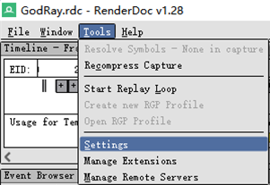
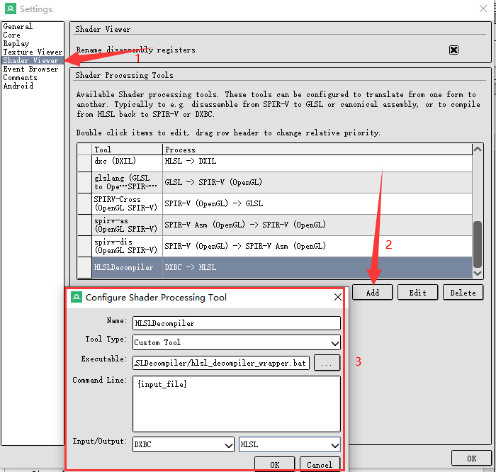
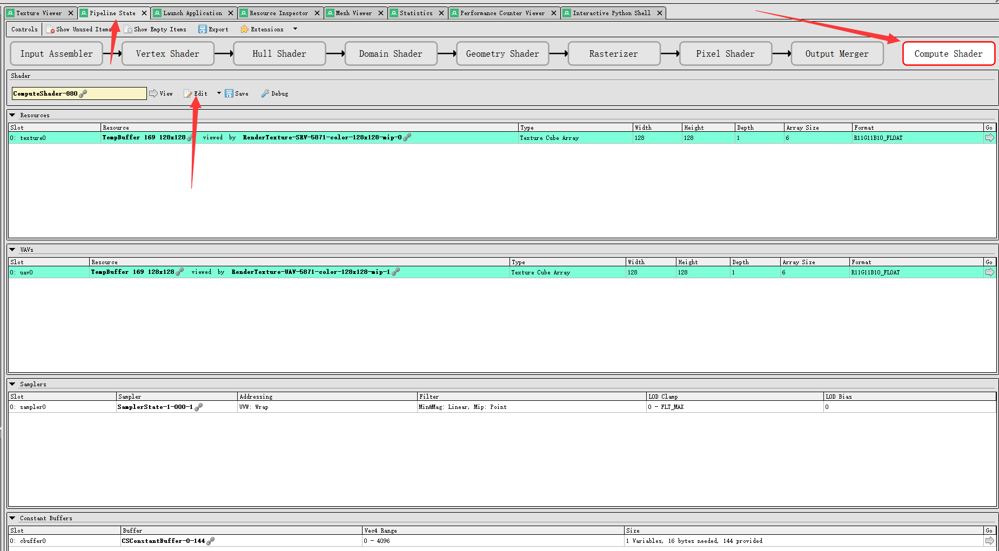
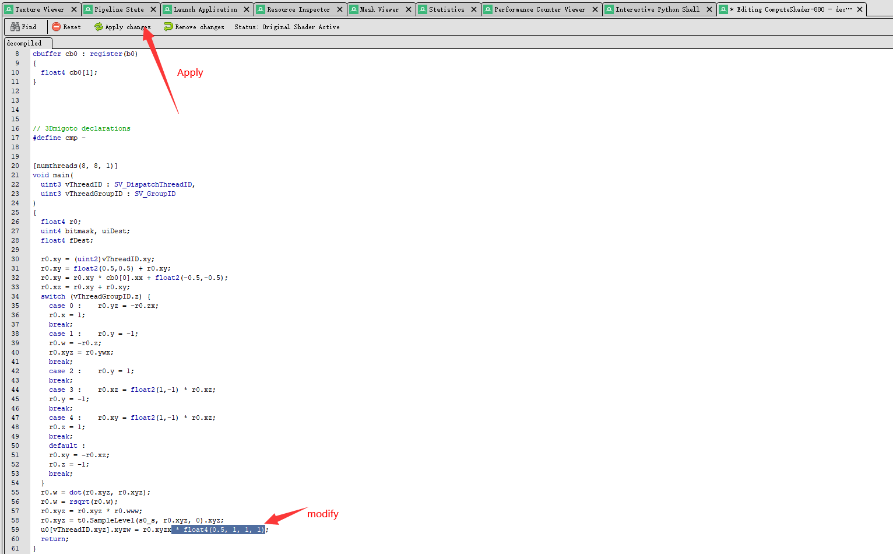

## HLSLDecompiler

&emsp;&emsp;翻译dxbc到hlsl源码，可以单独使用编译出的exe，也可以集成到renderdoc着色器处理工具中反编译着色器。 
&emsp;&emsp;虽然几乎是逐行翻译，但因为是hlsl源码，可以做到编辑反编译后的hlsl源码，然后重编译着色器到dxbc，这样可以在renderdoc查看修改效果。 
&emsp;&emsp;如果你没有源代码，这将对你学习和逆向游戏渲染技术时非常有用。

### 如何集成到renderdoc

1. 下载Release并解压，将 `hlsl_decompiler_wrapper.bat` 批处理文件和 `cmd_Decompiler.exe` 执行文件放在同一目录（建议直接放在renderdoc目录下）
2. Renderdoc -> Tools -> Settings -> Shader Viewer -> Add 

    | Field | Value |
    |------|:--------------:|
    | Name | HLSLDecompiler |
    | Tool Type | Custom Tool |
    | Executable | 设置 `hlsl_decompiler_wrapper.bat` 的绝对路径|
    | Command Line | {input_file} |
    | Input/Output | DXBC/HLSL |

3. Renderdoc -> Pipeline State View -> 选择一个 Shader Stage -> Edit -> Decompile with ${Name} 

4. 编辑你的shader，修改完成后，点Apply changes按钮应用你的修改，之后你可以在Texture Viewer查看到你修改后的内容 

### 来源
&emsp;&emsp;最开始的代码是3dmigoto，一个开源渲染mod框架，反编译功能是为了实时将dxbc dump出来、反编译、修改再覆盖回去，有开发者将反编译功能独立出来，作为renderdoc shader反编译插件。

### 已知问题
&emsp;&emsp;这个插件的功能相对完善，但依旧有很多hlsl的功能不支持（dxbc也不可能支持sm6.0后的指令），插件原有的逻辑是，遇到没处理的指令跳过，人为编辑修改后再重新编译。 
&emsp;&emsp;也可以check此工程，修改Parse逻辑后重新编译。